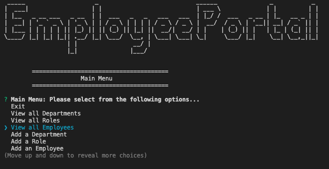

    
# Employee CMS Portal

## License

## Description
    
An example company CMS (content management system) that utilizes Node.js, Inquirer, and interacts with an employee database created using MySQL.

## Table of Contents

* [Installation](#installation)
* [Screenshot](#screenshot)
* [Usage](#usage)
* [Demo](#demo)
* [Credits](#credits)
* [License](#license)
* [Tests](#tests)
* [Questions](#questions)
    
## Installation

Make sure Node.js and MySQL are installed on your local machine. Clone the repo, and then navigate to the projects root directory. Run npm install. Open your instance of mysql from the command-line and run 'source db/db.sql', 'source db/schema.sql', and 'source db/seeds.sql' to populate and seed the database 'CMS'. Make sure to correctly add your own environment variables in the './db/connection.js' file for 'user', 'host', and 'password'.

## Screenshot

## Usage

To start the CLI app, type 'npm start' from within the project directory. Navigate the menus of the 'Employee Portal' as desired.

## Demo

*[Employee-Portal](https://drive.google.com/file/d/1-7HX-zYr2Q2pEyuEoFMVi3ogUt_w37yA/view)

## Credits

*[@coding-boot-camp](https://github.com/coding-boot-camp)

## Contributing

## Tests
no current test method

## Questions

Please send additional questions to [@coderjake91](https://github.com/coderjake91), email: jacob.b.frazer@gmail.com